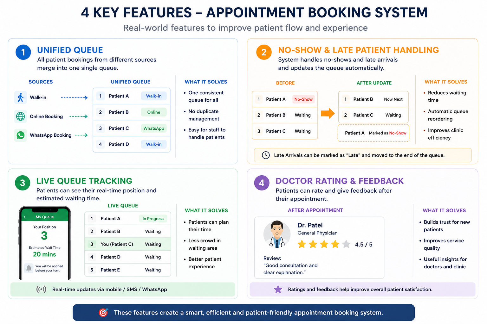

 

 
 # 🏥 Appointment Booking System API

## 📌 Overview
This is a backend API built using **NestJS, TypeORM, and PostgreSQL** for managing doctor appointments.

It supports patient registration, doctor management, appointment booking, and address handling.

 
## 🚀 Features

- 🔐 JWT Authentication (Login/Register)
- 👤 Patient Management
- 🧑‍⚕️ Doctor Management (Admin only)
- 📅 Appointment Booking System
- ⏱️ Slot-based scheduling
- 🔁 Reschedule & Cancel appointment
- 📍 Doctor Address API
- 🔒 Role-based access control (Admin / Patient)

 
## 🛠️ Tech Stack

- NestJS
- TypeORM
- PostgreSQL
- JWT Authentication
- class-validator

 
## ⚙️ Setup Instructions

### 1️⃣ Clone Project

```bash
git clone <your-repo-link>
cd appointment-schedula
````

### 2️⃣ Install Dependencies

```bash
npm install
```

### 3️⃣ Setup Environment Variables

Create `.env` file:

```env
DB_HOST=localhost
DB_PORT=5432
DB_USER=postgres
DB_PASS=yourpassword
DB_NAME=appointment
JWT_SECRET=secret
```

### 4️⃣ Run Project

```bash
npm run start:dev
```

---

## 📡 API Endpoints

### 🔐 Auth

* `POST /auth/register` → Register patient
* `POST /auth/login` → Login

### 👤 Patient

* `GET /patient`

### 🧑‍⚕️ Doctor

* `GET /doctor`
* `POST /doctor` (Admin only)
* `POST /doctor/:id/leave`
* `GET /doctor/:id/address`

### 📅 Appointment

* `POST /appointments`
* `GET /appointments/slots`
* `GET /appointments/next-available`
* `PATCH /appointments/:id/reschedule`
* `DELETE /appointments/:id`

---

## 🔒 Security Improvements

* No hardcoded credentials (uses `.env`)
* JWT authentication implemented
* DTO validation using `class-validator`
* Role-based access control
* Migrations used (no `synchronize:true`)

---

## 📌 Future Improvements

* Swagger API documentation
* Rate limiting
* Unit & integration testing
* Logging system

---

## 👨‍💻 Author


05/05/2026

# 🚀 Advanced Appointment Booking Features

The following real-world clinic workflow features are planned / analyzed for improving the appointment booking system.

---

## 1. Unified Queue Management

Manage walk-in, online, and WhatsApp bookings in a single queue system.

### Benefits
- Organized patient flow
- Single queue management
- Better clinic efficiency

---

## 2. No-show & Late Patient Handling

Automatically handle patients who miss or delay appointments.

### Benefits
- Dynamic queue updates
- Reduced waiting time
- Better appointment flow

---

## 3. Live Queue Tracking

Patients can view their queue position and estimated waiting time.

### Benefits
- Improved patient experience
- Reduced waiting area crowd
- Real-time tracking

---

## 4. Doctor Rating & Feedback System

Patients can rate doctors and provide reviews after appointments.

### Benefits
- Service quality improvement
- Better trust for patients
- Useful clinic insights

---

# 📊 Feature Overview


Aryan Chauhan

 
 
 

 
 
